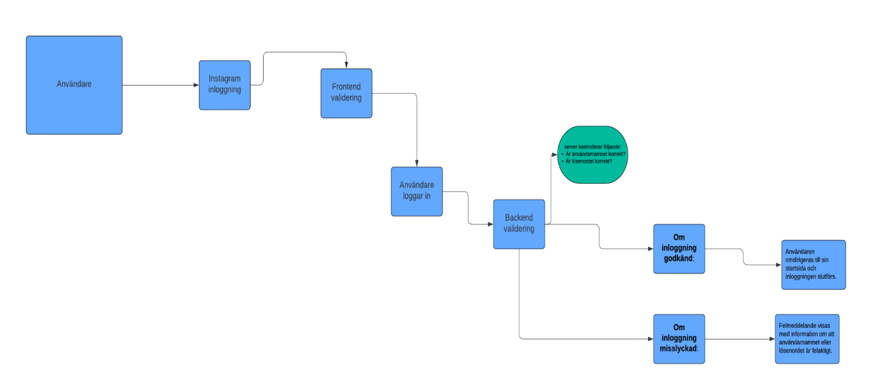

## Flödesschema

### Steg:

1. Användaren går till kontaktsidan.
2. Användaren fyller i formuläret.
3. Frontend validerar obligatoriska fält.
4. Användaren klickar på "Skicka".
5. Datan skickas till backend för validering.
6. Backend validerar och bearbetar datan.
7. Datan lagras i databasen och ett bekräftelsemeddelande visas för användaren, eller ett
   felmeddelande om något går fel.

### Diagram:

Exempel: Instagram inloggning process:

